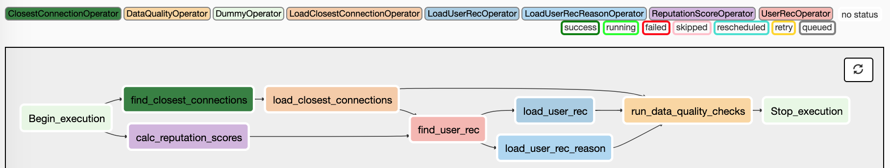

# Stocktwits Graph Based User Recommendation Pipeline

### Data Engineering Capstone Project

#### Project Scope

Stocktwits is a platform for active traders to exchange ideas. People post messages and the community can engage by liking or replying to the messages, or they can follow users. In order to cultivate a healthy community, we think it's pivotal to recommend the right people for users to follow. 

The recommendation process consists of the following steps.
1. Find 50 people that a user is closely engaged with in the last 3 months.
2. Calculate user reputation score based on an CNN-based NLP model trained on the text of posted messages.
3. Find second-degre  closest connections (i.e. closest connections of the 50 people in step 1), then only recommend those with good reputation scores. 

#### Data Overview

For closest connections, the input data are user activities stored in csv files, such as follow, reply, like and mention.
For user reputation scores, the input data are raw messages in json format along with their metadata.
An initial exploration of the data can be found [here](notebooks/User_Rec_Pipeline_Exploration.ipynb)
Both data sets have more than 10 million rows. 

#### Data Model

1. Data Model for find_closest_connections - postgresql table
The closest_connections table has the top 50 users that a user most closely engaged with in the last three months.

"""
    CREATE TABLE graph_recs.closest_connections (
    user_id             INT    NOT NULL,
    closest_connection  INT    NOT NULL,
    weight              Decimal     NOT NULL,
    created_at          TIMESTAMPTZ NOT NULL,
    updated_at          TIMESTAMPTZ NOT NULL,    
    PRIMARY KEY         (user_id, closest_connection)
    );
"""  

2. Data Model for calc_reputation_score - csv file
The csv file has two columns: user_id and score for each user.

3. Data Model for find_user_rec - postgresql tables
    - The recommnedations table contains the recommended users.
    - For every recommedation, we also store why it is made by looking at each closest connection's contribution. The rec_reasons table has that info.  

"""
    CREATE TABLE graph_recs.recommendations (
    user_id             INT    NOT NULL,
    rec_id              INT    NOT NULL,
    created_at          TIMESTAMPTZ NOT NULL,
    updated_at          TIMESTAMPTZ NOT NULL,    
    PRIMARY KEY         (user_id, rec_id)
    );
    
    CREATE TABLE graph_recs.rec_reasons (
    user_id             INT    NOT NULL,
    rec_id              INT    NOT NULL,
    reason_id           INT    NOT NULL,
    weight              Decimal    NOT NULL,
    created_at          TIMESTAMPTZ NOT NULL,
    updated_at          TIMESTAMPTZ NOT NULL,    
    PRIMARY KEY         (user_id, rec_id, reason_id)
    );    
"""  

#### Data Pipeline

##### Pipeline Explaination

Step 1 find_closest_connections and step 2 calc_reputation_scores are run in parallel.
Once step 1 is finished, the closest connections are uploaded to Postgres.
Once step 2 is finished, the scores are saved in a csv file on S3.

Then step 3 is performed and the results are uploaded to Postgres. 
Finally, data quality check runs for all tables in Postgres against a few test cases. 

##### Data Dictionary

table: closest_connection
fields:
  - name: user_id
    description: id of the user
    source: backend database
    
  - name: closest_connection
    description: a user that user_id is closely engaged with
    source: step 1 of the pipeline
    
  - name: weight
    description: a time-weighted engagement frequency
    source: step 1 of the pipeline
    
  - name: created_at 
    description: the timestamp that the record was initially created
    source: step 1 of the pipeline
    
  - name: updated_at
    description: the timestamp that the record was updated
    source: find_closest_connections   
    
csv file: reputation_score
fields:
  - name: user_id
    description: id of the user
    source: backend database
    
  - name: pred
    description: a number between 0 and 1 (1 being the highest), indicating how similar that a user is to Stocktwits handpicked good users in terms of choice of words and information quality.
    source: calc_reputation_scores
    
table: recommendations
description: user recomendations
fields: 
  - name: user_id
    description: id of the user who gets the recommendations
    source: backend database
    
  - name: rec_id
    description: id of the user being recommended based on 2nd degree connections of the user and reputation score.   
    source: step 3 of the pipeline

  - name: created_at and updated_at, same as in the closest_connection table 
    
     
table: rec_reasons
description: reasons for why a user is recommended
fields: 
  - names: all fields from recommendations table
  
  - name: reason_id
    description: id of a user who is a closest connection of user_id that leads to the recommendation of rec_id
    source: step 3 of the pipeline
    
  - name: weight
    description: contribution of reason_id to the recommendation of rec_id
    source: step 3 of the pipeline

    

#### Other Considerations

##### Addressing Additional Scenarios

> *The data was increased by 100x.*  
> 
> If the data was increased by 100x we would consider using a Spark to distribute the work load to many workers and therefore it would process a larger amount of data more efficiently. 

> *The pipelines would be run on a daily basis by 7 am every day.*  
> 
> This pipeline already runs once a day at 8AM. To update this to run at 7AM, we would simply update the cron schedule in the airflow dag to '0 7 * * *'.

> *The database needed to be accessed by 100+ people.*  
> 
> If the database needs to be accessed by many people, and we only have a single node we can start using connection pooling and minimum viable checkouts. And if we have many nodes, we can resort to using PgBouncer to maintain a global connection pool to optimize connection use across all nodes.

##### Choice of Tools

For the user recommendation pipeline, we chose to use S3 as a temporaty data layer, Postgres for our database and airflow for ETL orchestration. S3 is the perfect tool for scalable storage to use to pass data between different parts of our processing pipeline. 

The output data is fairly simple. We could go with either a relationship database or a non-relational key-value store. 
We opted for a relational data model because there are use cases where we might want to query/filter non-key values and key/value stores usually are not optimized for that. Also we might also need to join the results with metadata, which again would work better with relational database.

Airflow has the flexability to break our pipeline down into modular chunks and runs them on a schedule. The custom operators give us the the ability to extend Airflows cababilities to better organize the code and additionally allow us to build data quality checks in first hand.
